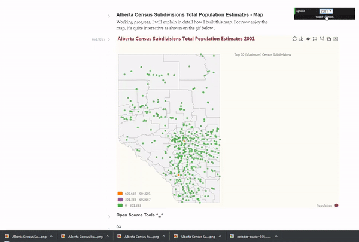

### Credits
- <a href="https://open.alberta.ca/opendata/6647c7b5-b173-4711-a493-dad08308d501#summary" target="_blank">2016 Federal Census Division - Alberta Open Data</a>
- <a href="https://regionaldashboard.alberta.ca/#/" target="_blank">Alberta Regional Dashboard</a>
- <a href="https://gist.githubusercontent.com/mikelotis/6f2887d02d5b44c411785acb641764c0/raw/85cf11f306bccad1b8198261689f3f3d1dfaaeb1/canada.json" target="_blank">Canada's Topojson</a>
- <a href="https://stackoverflow.com/questions/39713333/nodejs-utf-8-encoded-string-has-black-question-mark" target="_blank">UTF-8 encoded string has black question mark</a>
- <a href="https://github.com/Edmonton-Open-Data/Edmonton-Bylaw-Infractions-I/blob/master/js/infractions.js" target="_blank">Edmonton-Bylaw-Infractions-I</a>
- <a href="https://ecomfe.github.io/echarts-examples/public/editor.html?c=map-province" target="_blank">Echarts - Switch among 34 Provinces</a>
- <a href="https://raw.githubusercontent.com/apache/incubator-echarts/master/map/json/world.json" target="_blank">Reference Geojson used - to get mouse hovering effect</a>
- <a href="https://mapshaper.org/" target="_blank">Mapshaper</a>
- <a href="https://ecomfe.github.io/echarts-doc/public/en/option.html#title" target="_blank">Echarts Documentation</a>
- <a href="https://ecomfe.github.io/echarts-doc/public/en/option.html#geo" target="_blank">Echarts Documentation - geo</a>
- <a href="https://ecomfe.github.io/echarts-doc/public/en/option.html#visualMap-piecewise.formatter" target="_blank">Echarts Documentation - formatter</a>
- <a href="https://ecomfe.github.io/echarts-examples/public/editor.html?c=doc-example/scatter-visualMap-piecewise" target="_blank">Echarts - VisualMap Piecewise</a>
- <a href="https://ecomfe.github.io/echarts-examples/public/editor.html?c=scatter-map" target="_blank">Echarts - Scatter Map</a>
- <a href="https://ecomfe.github.io/echarts-examples/public/editor.html?c=scatter-map-brush" target="_blank">Echarts - Scatter Map Brush</a>
- <a href="http://echarts.baidu.com/theme-builder/" target="_blank">Echarts-Theme Builder</a>
- <a href="https://stackoverflow.com/questions/14123999/center-a-div-horizontally-and-vertically" target="_blank">Center a DIV horizontally and vertically [duplicate]</a>
- <a href="http://colorbrewer2.org/#type=qualitative&scheme=Set1&n=5" target="_blank">Color Brewer</a>
- <a href="https://ezgif.com/" target="_blank">EZGIF - to make demo gif and video</a>
- <a href="https://obsproject.com/" target="_blank">OBS Studio - for screen recording</a>

### My Other Projects
Criticism and feedback highly recommended.  
Shoot me an <a href="https://mikelotis.github.io/#web" target="_blank">email</a> or message me <a href="https://twitter.com/Michael_Otyz" target="_blank">@Michael_Otyz</a>.
- <a href="https://mikelotis.github.io/" target="_blank"><strong>OTHER PROJECTS</strong></a>
